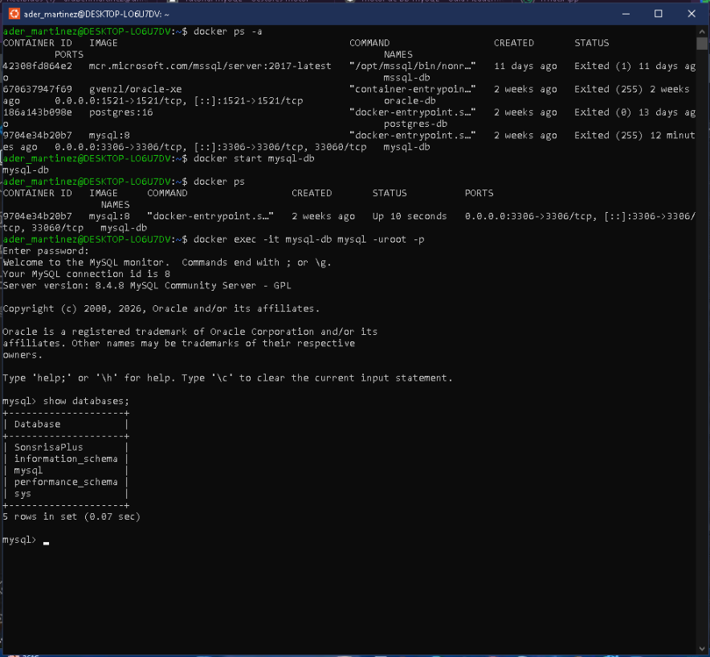
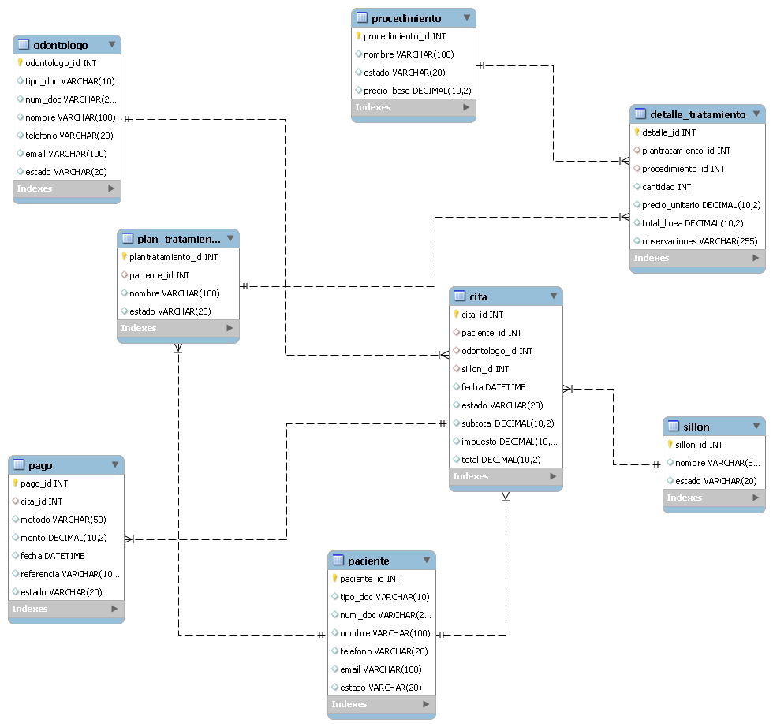
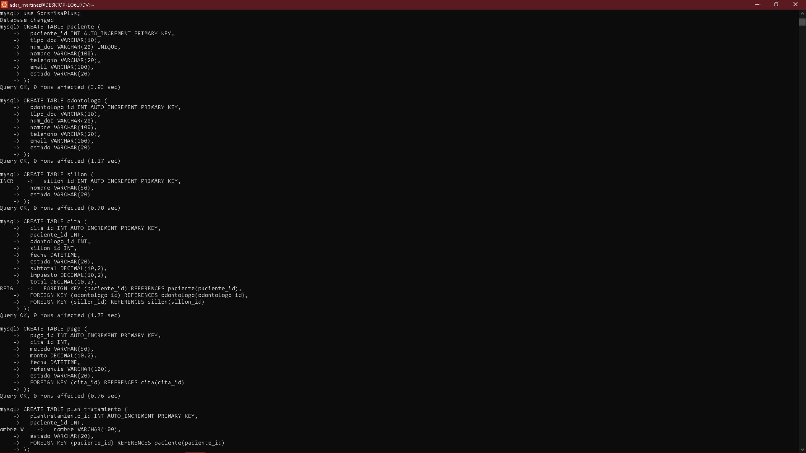
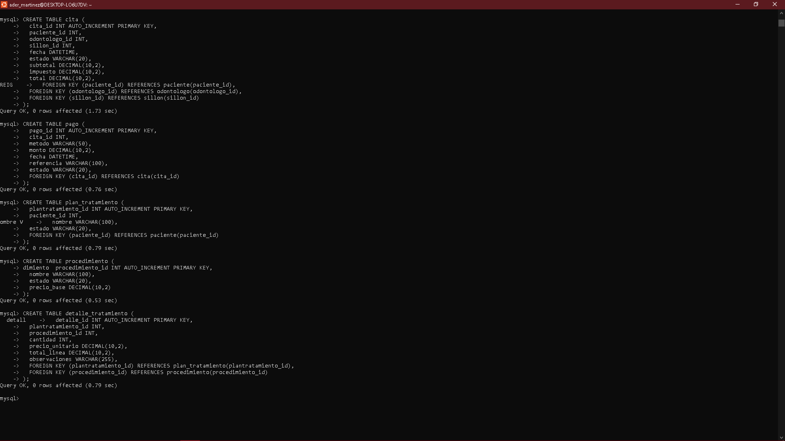
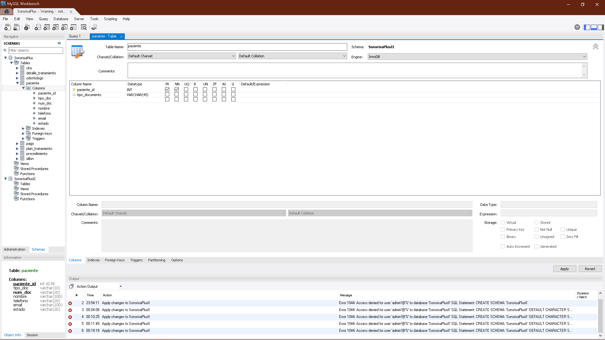
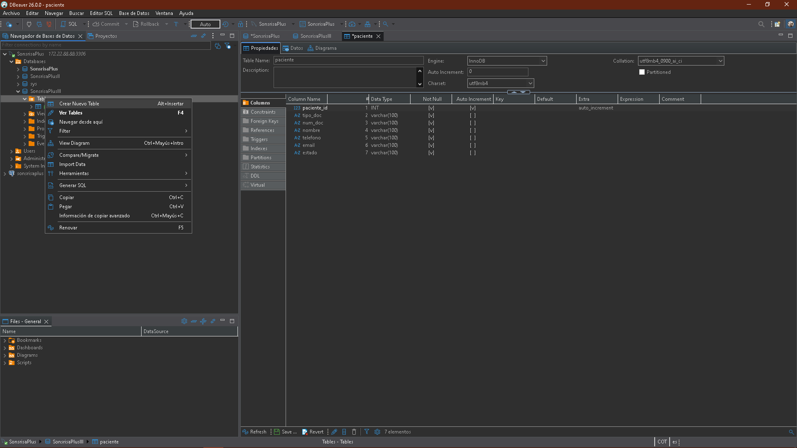
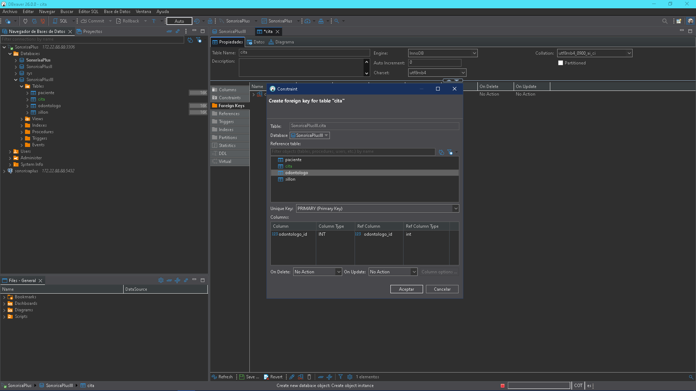

# SonrisaPlus – Consultorio Odontológico
## Desarrollo de Base de Datos Multiplataforma

---

## 1. Diagrama Entidad-Relación

El siguiente diagrama representa la estructura de la base de datos **SonrisaPlus**, diseñada para la gestión de un consultorio odontológico. Incluye las entidades principales: Paciente, Odontólogo, Sillón, Cita, Plan de Tratamiento, Procedimiento, Detalle de Tratamiento y Pago.

### Entidades y relaciones

| Entidad | Relación | Entidad |
|---|---|---|
| PACIENTE | tiene (1:N) | CITA |
| ODONTOLOGO | atiende (1:N) | CITA |
| SILLON | es usado en (1:N) | CITA |
| CITA | genera (1:N) | PAGO |
| PACIENTE | tiene (1:N) | PLAN_TRATAMIENTO |
| PLAN_TRATAMIENTO | contiene (N:M via DETALLE) | PROCEDIMIENTO |

---

### 1.1 MySQL

#### Editor propio del motor (MySQL CLI)

Para visualizar el diagrama ER desde el editor de MySQL, se ejecuta el script DDL dentro del contenedor Docker y se consultan las tablas creadas:

```bash
docker exec -it mysql-db mysql -uroot -p
```

```sql
USE SonsrisaPlus;
SHOW TABLES;
```

> Conexión y creación de la base de datos en el editor MySQL CLI:



---

#### MySQL Workbench

Para visualizar el ER en **MySQL Workbench**:

1. Abrir MySQL Workbench → conectar al servidor.
2. En el panel izquierdo, expandir el schema `SonsrisaPlus`.
3. Ir a **Database > Reverse Engineer** para generar el diagrama EER automáticamente.

> Diagrama Entidad-Relación generado en MySQL Workbench (Reverse Engineer):



---

#### DBeaver con MySQL

Para visualizar el ER en **DBeaver** con conexión MySQL:

1. Conectar a la base de datos MySQL en DBeaver (host: `172.22.88.88`, puerto: `3306`).
2. En el panel izquierdo, expandir `SonsrisaPlus > Tables`.
3. Seleccionar todas las tablas → click derecho → **View Diagram**.

> Configuración de la conexión MySQL en DBeaver:


---

### 1.2 PostgreSQL

#### Editor propio del motor (psql)

Para conectar al contenedor PostgreSQL y visualizar la base de datos:

```bash
docker exec -it postgres-db psql -U postgres
```

```sql
\l          -- listar bases de datos
\c sonsrisaplus   -- conectar a la BD
\dt         -- listar tablas
```

> Conexión al servidor PostgreSQL via Docker y listado de bases de datos:


> Base de datos `sonsrisaplus` creada y visible en el listado:


---

#### DBeaver con PostgreSQL

1. Conectar a PostgreSQL en DBeaver (puerto `5432`).
2. Expandir `sonsrisaplus > Schemas > public > Tables`.
3. Click derecho → **View Diagram**.

> *Pendiente: captura del diagrama ER en DBeaver con conexión PostgreSQL.*

---

#### pgAdmin 4

1. Abrir **pgAdmin 4** → conectar al servidor PostgreSQL.
2. Expandir `Databases > sonsrisaplus > Schemas > public > Tables`.
3. Click derecho sobre `public` → **ERD for Database**.

> *Pendiente: captura del diagrama ER en pgAdmin 4.*

---

## 2. Creación de la Base de Datos Física

### 2.1 MySQL

#### Paso 1 – Crear la base de datos (MySQL CLI)

```sql
CREATE DATABASE SonsrisaPlus;
SHOW DATABASES;
CREATE USER 'admin'@'%' IDENTIFIED BY '12345';
GRANT ALL PRIVILEGES ON SonsrisaPlus.* TO 'admin'@'%';
FLUSH PRIVILEGES;
```

> Creación de la base de datos y usuario en el editor MySQL CLI:


---

#### Paso 2 – Crear las tablas (MySQL CLI)

```sql
USE SonsrisaPlus;

CREATE TABLE paciente (
  paciente_id INT AUTO_INCREMENT PRIMARY KEY,
  tipo_doc    VARCHAR(10),
  num_doc     VARCHAR(20) UNIQUE,
  nombre      VARCHAR(100),
  telefono    VARCHAR(20),
  email       VARCHAR(100),
  estado      VARCHAR(20)
);

CREATE TABLE odontologo (
  odontologo_id INT AUTO_INCREMENT PRIMARY KEY,
  tipo_doc      VARCHAR(10),
  num_doc       VARCHAR(20),
  nombre        VARCHAR(100),
  telefono      VARCHAR(20),
  email         VARCHAR(100),
  estado        VARCHAR(20)
);

CREATE TABLE sillon (
  sillon_id INT AUTO_INCREMENT PRIMARY KEY,
  nombre    VARCHAR(50),
  estado    VARCHAR(20)
);

CREATE TABLE cita (
  cita_id       INT AUTO_INCREMENT PRIMARY KEY,
  paciente_id   INT,
  odontologo_id INT,
  sillon_id     INT,
  fecha         DATETIME,
  estado        VARCHAR(20),
  subtotal      DECIMAL(10,2),
  impuesto      DECIMAL(10,2),
  total         DECIMAL(10,2),
  FOREIGN KEY (paciente_id)   REFERENCES paciente(paciente_id),
  FOREIGN KEY (odontologo_id) REFERENCES odontologo(odontologo_id),
  FOREIGN KEY (sillon_id)     REFERENCES sillon(sillon_id)
);

CREATE TABLE pago (
  pago_id    INT AUTO_INCREMENT PRIMARY KEY,
  cita_id    INT,
  metodo     VARCHAR(50),
  monto      DECIMAL(10,2),
  fecha      DATETIME,
  referencia VARCHAR(100),
  estado     VARCHAR(20),
  FOREIGN KEY (cita_id) REFERENCES cita(cita_id)
);

CREATE TABLE plan_tratamiento (
  plantratamiento_id INT AUTO_INCREMENT PRIMARY KEY,
  paciente_id        INT,
  nombre             VARCHAR(100),
  estado             VARCHAR(20),
  FOREIGN KEY (paciente_id) REFERENCES paciente(paciente_id)
);

CREATE TABLE procedimiento (
  procedimiento_id INT AUTO_INCREMENT PRIMARY KEY,
  nombre           VARCHAR(100),
  estado           VARCHAR(20),
  precio_base      DECIMAL(10,2)
);

CREATE TABLE detalle_tratamiento (
  detalle_id         INT AUTO_INCREMENT PRIMARY KEY,
  plantratamiento_id INT,
  procedimiento_id   INT,
  cantidad           INT,
  precio_unitario    DECIMAL(10,2),
  total_linea        DECIMAL(10,2),
  observaciones      VARCHAR(255),
  FOREIGN KEY (plantratamiento_id) REFERENCES plan_tratamiento(plantratamiento_id),
  FOREIGN KEY (procedimiento_id)   REFERENCES procedimiento(procedimiento_id)
);
```

> Ejecución del script de creación de tablas — parte 1 (paciente, odontologo, sillon, cita, pago):



> Ejecución del script — parte 2 (plan_tratamiento, procedimiento, detalle_tratamiento):



---

#### Paso 3 – Verificar estructura de las tablas (MySQL CLI)

```sql
DESCRIBE paciente;
DESCRIBE cita;
DESCRIBE detalle_tratamiento;
DESCRIBE odontologo;
DESCRIBE pago;
DESCRIBE plan_tratamiento;
DESCRIBE procedimiento;
DESCRIBE sillon;
```

> Verificación con `DESCRIBE` — paciente y cita:


> Verificación — continuación cita y detalle_tratamiento:


> Verificación — SHOW TABLES y paciente/cita (vista alternativa):


> Verificación — detalle_tratamiento y odontologo:


> Verificación — odontologo, pago y plan_tratamiento:


> Verificación — plan_tratamiento, procedimiento y sillon:


---

#### Paso 4 – Verificar en MySQL Workbench

1. Abrir **MySQL Workbench** → conectar al servidor.
2. En el panel *Navigator* → expandir `SonsrisaPlus > Tables`.
3. Las 8 tablas aparecen en el schema.

> Schema `SonsrisaPlus` en MySQL Workbench mostrando las tablas creadas:


> Vista de columnas de la tabla `paciente` en MySQL Workbench:



---

#### Paso 5 – Verificar en DBeaver (MySQL)

1. Abrir DBeaver → conexión MySQL (`172.22.88.88:3306`).
2. Expandir `SonsrisaPlus > Tables`.
3. Al inspeccionar la tabla `paciente`, se muestran las columnas y propiedades.

> DBeaver con MySQL — estructura de la tabla `paciente`:



> DBeaver con MySQL — definición de Foreign Key en la tabla `cita`:



---

### 2.2 PostgreSQL

#### Paso 1 – Conectar al servidor PostgreSQL (psql via Docker)

```bash
docker exec -it postgres-db psql -U postgres
```

> Conexión exitosa al contenedor PostgreSQL y listado de bases de datos con `\l`:


---

#### Paso 2 – Crear la base de datos

```sql
CREATE DATABASE sonsrisaplus;
\c sonsrisaplus
```

> Base de datos `sonsrisaplus` creada y visible en el listado:


---

#### Paso 3 – Crear las tablas

```sql
CREATE TABLE paciente (
  paciente_id SERIAL PRIMARY KEY,
  tipo_doc    VARCHAR(10)  NOT NULL,
  num_doc     VARCHAR(20)  UNIQUE NOT NULL,
  nombre      VARCHAR(100) NOT NULL,
  telefono    VARCHAR(20),
  email       VARCHAR(100),
  estado      VARCHAR(20)  NOT NULL
);

CREATE TABLE odontologo (
  odontologo_id SERIAL PRIMARY KEY,
  tipo_doc      VARCHAR(10),
  num_doc       VARCHAR(20),
  nombre        VARCHAR(100),
  telefono      VARCHAR(20),
  email         VARCHAR(100),
  estado        VARCHAR(20)
);

CREATE TABLE sillon (
  sillon_id SERIAL PRIMARY KEY,
  nombre    VARCHAR(50),
  estado    VARCHAR(20)
);

CREATE TABLE cita (
  cita_id       SERIAL PRIMARY KEY,
  paciente_id   INT           NOT NULL,
  odontologo_id INT           NOT NULL,
  sillon_id     INT           NOT NULL,
  fecha         TIMESTAMP     NOT NULL,
  estado        VARCHAR(20)   NOT NULL,
  subtotal      DECIMAL(10,2) NOT NULL,
  impuesto      DECIMAL(10,2) NOT NULL,
  total         DECIMAL(10,2) NOT NULL,
  CONSTRAINT fk_cita_paciente   FOREIGN KEY (paciente_id)   REFERENCES paciente(paciente_id),
  CONSTRAINT fk_cita_odontologo FOREIGN KEY (odontologo_id) REFERENCES odontologo(odontologo_id),
  CONSTRAINT fk_cita_sillon     FOREIGN KEY (sillon_id)     REFERENCES sillon(sillon_id)
);

CREATE TABLE plan_tratamiento (
  plantratamiento_id SERIAL PRIMARY KEY,
  paciente_id        INT NOT NULL,
  nombre             VARCHAR(100),
  estado             VARCHAR(20),
  CONSTRAINT fk_pt_paciente FOREIGN KEY (paciente_id) REFERENCES paciente(paciente_id)
);

CREATE TABLE procedimiento (
  procedimiento_id SERIAL PRIMARY KEY,
  nombre           VARCHAR(100),
  estado           VARCHAR(20),
  precio_base      DECIMAL(10,2)
);

CREATE TABLE detalle_tratamiento (
  detalle_id         SERIAL PRIMARY KEY,
  plantratamiento_id INT           NOT NULL,
  procedimiento_id   INT           NOT NULL,
  cantidad           INT           NOT NULL,
  precio_unitario    DECIMAL(10,2) NOT NULL,
  total_linea        DECIMAL(10,2) NOT NULL,
  observaciones      VARCHAR(255),
  CONSTRAINT fk_dt_plan FOREIGN KEY (plantratamiento_id) REFERENCES plan_tratamiento(plantratamiento_id),
  CONSTRAINT fk_dt_proc FOREIGN KEY (procedimiento_id)   REFERENCES procedimiento(procedimiento_id)
);

CREATE TABLE pago (
  pago_id    SERIAL PRIMARY KEY,
  cita_id    INT           NOT NULL,
  metodo     VARCHAR(50),
  monto      DECIMAL(10,2),
  fecha      TIMESTAMP,
  referencia VARCHAR(100),
  estado     VARCHAR(20),
  CONSTRAINT fk_pago_cita FOREIGN KEY (cita_id) REFERENCES cita(cita_id)
);
```

> Creación de la primera tabla `paciente` en psql con confirmación `CREATE TABLE`:


> Continuación de la creación de tablas en psql:


> Creación completa de todas las tablas en psql:


---

#### Paso 4 – Verificar en pgAdmin 4

1. Abrir **pgAdmin 4** → conectar al servidor PostgreSQL.
2. Expandir `Databases > sonsrisaplus > Schemas > public > Tables`.
3. Deben aparecer las 8 tablas creadas.

> *Pendiente: captura de pgAdmin 4 mostrando las tablas de sonsrisaplus.*

---

#### Paso 5 – Verificar en DBeaver (PostgreSQL)

1. Abrir DBeaver → conexión PostgreSQL (puerto `5432`).
2. Expandir `sonsrisaplus > Schemas > public > Tables`.

> *Pendiente: captura de DBeaver con conexión PostgreSQL mostrando las tablas.*

---

### 2.3 MS SQL Server

#### Paso 1 – Crear la base de datos

```sql
CREATE DATABASE SonrisaPlus
  COLLATE Modern_Spanish_CI_AS;
GO

USE SonrisaPlus;
GO
```

#### Paso 2 – Crear las tablas

```sql
CREATE TABLE paciente (
  paciente_id   INT IDENTITY(1,1) PRIMARY KEY,
  tipo_doc      VARCHAR(10)   NOT NULL,
  num_doc       VARCHAR(20)   NOT NULL UNIQUE,
  nombre        VARCHAR(100)  NOT NULL,
  telefono      VARCHAR(20),
  email         VARCHAR(100),
  estado        VARCHAR(20)   NOT NULL
);
GO

CREATE TABLE odontologo (
  odontologo_id INT IDENTITY(1,1) PRIMARY KEY,
  tipo_doc      VARCHAR(10),
  num_doc       VARCHAR(20),
  nombre        VARCHAR(100),
  telefono      VARCHAR(20),
  email         VARCHAR(100),
  estado        VARCHAR(20)
);
GO

CREATE TABLE sillon (
  sillon_id INT IDENTITY(1,1) PRIMARY KEY,
  nombre    VARCHAR(50),
  estado    VARCHAR(20)
);
GO

CREATE TABLE cita (
  cita_id       INT IDENTITY(1,1) PRIMARY KEY,
  paciente_id   INT           NOT NULL,
  odontologo_id INT           NOT NULL,
  sillon_id     INT           NOT NULL,
  fecha         DATETIME      NOT NULL,
  estado        VARCHAR(20)   NOT NULL,
  subtotal      DECIMAL(10,2) NOT NULL,
  impuesto      DECIMAL(10,2) NOT NULL,
  total         DECIMAL(10,2) NOT NULL,
  CONSTRAINT fk_cita_paciente   FOREIGN KEY (paciente_id)   REFERENCES paciente(paciente_id),
  CONSTRAINT fk_cita_odontologo FOREIGN KEY (odontologo_id) REFERENCES odontologo(odontologo_id),
  CONSTRAINT fk_cita_sillon     FOREIGN KEY (sillon_id)     REFERENCES sillon(sillon_id)
);
GO

CREATE TABLE plan_tratamiento (
  plantratamiento_id INT IDENTITY(1,1) PRIMARY KEY,
  paciente_id        INT NOT NULL,
  nombre             VARCHAR(100),
  estado             VARCHAR(20),
  CONSTRAINT fk_pt_paciente FOREIGN KEY (paciente_id) REFERENCES paciente(paciente_id)
);
GO

CREATE TABLE procedimiento (
  procedimiento_id INT IDENTITY(1,1) PRIMARY KEY,
  nombre           VARCHAR(100),
  estado           VARCHAR(20),
  precio_base      DECIMAL(10,2)
);
GO

CREATE TABLE detalle_tratamiento (
  detalle_id         INT IDENTITY(1,1) PRIMARY KEY,
  plantratamiento_id INT           NOT NULL,
  procedimiento_id   INT           NOT NULL,
  cantidad           INT           NOT NULL,
  precio_unitario    DECIMAL(10,2) NOT NULL,
  total_linea        DECIMAL(10,2) NOT NULL,
  observaciones      VARCHAR(255),
  CONSTRAINT fk_dt_plan FOREIGN KEY (plantratamiento_id) REFERENCES plan_tratamiento(plantratamiento_id),
  CONSTRAINT fk_dt_proc FOREIGN KEY (procedimiento_id)   REFERENCES procedimiento(procedimiento_id)
);
GO

CREATE TABLE pago (
  pago_id    INT IDENTITY(1,1) PRIMARY KEY,
  cita_id    INT           NOT NULL,
  metodo     VARCHAR(50),
  monto      DECIMAL(10,2),
  fecha      DATETIME,
  referencia VARCHAR(100),
  estado     VARCHAR(20),
  CONSTRAINT fk_pago_cita FOREIGN KEY (cita_id) REFERENCES cita(cita_id)
);
GO
```

> *Pendiente: capturas del editor SQL Server, DBeaver y SSMS con las tablas creadas.*

---

### 2.4 Oracle

#### Paso 1 – Crear el usuario/schema

```sql
CREATE USER sonrisaplus IDENTIFIED BY sonrisa123
  DEFAULT TABLESPACE users
  QUOTA UNLIMITED ON users;

GRANT CREATE SESSION, CREATE TABLE, CREATE SEQUENCE TO sonrisaplus;
```

#### Paso 2 – Crear las tablas

```sql
CREATE TABLE paciente (
  paciente_id NUMBER GENERATED ALWAYS AS IDENTITY PRIMARY KEY,
  tipo_doc    VARCHAR2(10)   NOT NULL,
  num_doc     VARCHAR2(20)   NOT NULL UNIQUE,
  nombre      VARCHAR2(100)  NOT NULL,
  telefono    VARCHAR2(20),
  email       VARCHAR2(100),
  estado      VARCHAR2(20)   NOT NULL
);

CREATE TABLE odontologo (
  odontologo_id NUMBER GENERATED ALWAYS AS IDENTITY PRIMARY KEY,
  tipo_doc      VARCHAR2(10),
  num_doc       VARCHAR2(20),
  nombre        VARCHAR2(100),
  telefono      VARCHAR2(20),
  email         VARCHAR2(100),
  estado        VARCHAR2(20)
);

CREATE TABLE sillon (
  sillon_id NUMBER GENERATED ALWAYS AS IDENTITY PRIMARY KEY,
  nombre    VARCHAR2(50),
  estado    VARCHAR2(20)
);

CREATE TABLE cita (
  cita_id       NUMBER GENERATED ALWAYS AS IDENTITY PRIMARY KEY,
  paciente_id   NUMBER        NOT NULL,
  odontologo_id NUMBER        NOT NULL,
  sillon_id     NUMBER        NOT NULL,
  fecha         TIMESTAMP     NOT NULL,
  estado        VARCHAR2(20)  NOT NULL,
  subtotal      NUMBER(10,2)  NOT NULL,
  impuesto      NUMBER(10,2)  NOT NULL,
  total         NUMBER(10,2)  NOT NULL,
  CONSTRAINT fk_cita_paciente   FOREIGN KEY (paciente_id)   REFERENCES paciente(paciente_id),
  CONSTRAINT fk_cita_odontologo FOREIGN KEY (odontologo_id) REFERENCES odontologo(odontologo_id),
  CONSTRAINT fk_cita_sillon     FOREIGN KEY (sillon_id)     REFERENCES sillon(sillon_id)
);

CREATE TABLE plan_tratamiento (
  plantratamiento_id NUMBER GENERATED ALWAYS AS IDENTITY PRIMARY KEY,
  paciente_id        NUMBER NOT NULL,
  nombre             VARCHAR2(100),
  estado             VARCHAR2(20),
  CONSTRAINT fk_pt_paciente FOREIGN KEY (paciente_id) REFERENCES paciente(paciente_id)
);

CREATE TABLE procedimiento (
  procedimiento_id NUMBER GENERATED ALWAYS AS IDENTITY PRIMARY KEY,
  nombre           VARCHAR2(100),
  estado           VARCHAR2(20),
  precio_base      NUMBER(10,2)
);

CREATE TABLE detalle_tratamiento (
  detalle_id         NUMBER GENERATED ALWAYS AS IDENTITY PRIMARY KEY,
  plantratamiento_id NUMBER        NOT NULL,
  procedimiento_id   NUMBER        NOT NULL,
  cantidad           NUMBER        NOT NULL,
  precio_unitario    NUMBER(10,2)  NOT NULL,
  total_linea        NUMBER(10,2)  NOT NULL,
  observaciones      VARCHAR2(255),
  CONSTRAINT fk_dt_plan FOREIGN KEY (plantratamiento_id) REFERENCES plan_tratamiento(plantratamiento_id),
  CONSTRAINT fk_dt_proc FOREIGN KEY (procedimiento_id)   REFERENCES procedimiento(procedimiento_id)
);

CREATE TABLE pago (
  pago_id    NUMBER GENERATED ALWAYS AS IDENTITY PRIMARY KEY,
  cita_id    NUMBER        NOT NULL,
  metodo     VARCHAR2(50),
  monto      NUMBER(10,2),
  fecha      TIMESTAMP,
  referencia VARCHAR2(100),
  estado     VARCHAR2(20),
  CONSTRAINT fk_pago_cita FOREIGN KEY (cita_id) REFERENCES cita(cita_id)
);
```

> *Pendiente: capturas del editor Oracle, DBeaver y SQL Developer con las tablas creadas.*

---

## Tabla resumen de diferencias por motor

| Característica | MySQL | PostgreSQL | MS SQL Server | Oracle |
|---|---|---|---|---|
| Auto-increment | `AUTO_INCREMENT` | `SERIAL` | `IDENTITY(1,1)` | `GENERATED ALWAYS AS IDENTITY` |
| Tipo entero | `INT` | `INT` | `INT` | `NUMBER` |
| Tipo texto | `VARCHAR` | `VARCHAR` | `VARCHAR` | `VARCHAR2` |
| Tipo fecha/hora | `DATETIME` | `TIMESTAMP` | `DATETIME` | `TIMESTAMP` |
| Tipo decimal | `DECIMAL(p,s)` | `DECIMAL(p,s)` | `DECIMAL(p,s)` | `NUMBER(p,s)` |
| Separador sentencias | `;` | `;` | `GO` | `;` |
| Gestor recomendado | Workbench | pgAdmin 4 | SSMS | SQL Developer |

---

## Notas finales

- Copiar la carpeta `images/` junto al archivo `.Rmd` antes de hacer commit al repositorio.
- Todas las imágenes deben tomarse después de ejecutar los scripts en cada motor.
- El repositorio GitHub debe incluir: el archivo `.Rmd`, la carpeta `images/` y el `.md` generado.
- Enlace del repositorio a entregar en Classroom y Akumaja.
